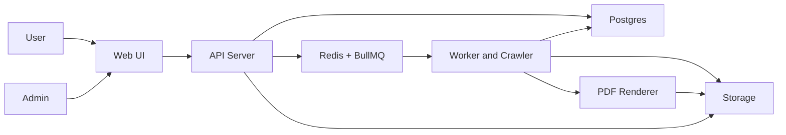

# System Architecture - Story to PDF Web App

## Overview
A web app that lets users submit a story URL, scans the table of contents, fetches chapters, normalizes content, and generates a PDF. The system is designed for small-scale workloads with a single API instance and a small worker pool.

Small-scale assumptions:
- Single API server instance
- 1-2 worker instances for crawl and PDF jobs
- Up to 10 concurrent jobs, up to 1,000 PDFs per day
- Postgres for all metadata and status tracking
- Redis + BullMQ for async job orchestration

User roles:
- User: submit URLs, view job status, download PDFs, manage own stories
- Admin: view all jobs, retry or cancel jobs, manage users, audit activity

## Components
- Web UI: User and admin interfaces for submission, status, and downloads
- API Server: Validates input, persists metadata, enqueues jobs, serves PDFs
- Postgres: Stores users, stories, TOC items, chapters, jobs, and files metadata
- Redis + BullMQ: Job queues for crawling, normalization, and PDF rendering
- Worker and Crawler: Fetches TOC and chapters, normalizes content, creates PDFs
- Storage:
  - Dev: local disk for chapter HTML and PDF artifacts
  - Prod: Supabase Storage for PDF and chapter assets

## Data Flow
1. User submits a story URL via Web UI.
2. API validates URL and creates a story record in Postgres.
3. API enqueues a crawl job in BullMQ.
4. Worker fetches the TOC and chapter URLs, saves TOC items.
5. Worker fetches chapters, normalizes content, stores normalized data.
6. Worker enqueues a PDF render job after all chapters are ready.
7. PDF renderer assembles the PDF and stores it in Storage.
8. API updates job status and exposes a download link.

## Storage
- Postgres: Primary metadata store, job state, chapter status, file records
- Redis: Job queues, retry state, and rate limiting counters
- Local disk (dev): storage/chapters, storage/pdfs
- Supabase Storage (prod): chapters/ and pdfs/ buckets

## Security/Compliance
- Authentication: JWT with short-lived access tokens and refresh tokens
- Authorization: RBAC for user and admin actions
- Input validation: URL validation and allowlist for supported domains
- SSRF protection: block private IP ranges and internal hostnames
- Rate limiting: per user and per IP limits on submission endpoints
- Data retention: configurable TTL for raw chapter content
- Secrets: stored only in environment variables, never in code
- PII: minimal storage (email, name); no chapter content in logs

## Observability
- Structured logs: Pino JSON logs with requestId and jobId
- Metrics: Prometheus counters for job counts, failures, and durations
- Tracing: OpenTelemetry spans for crawl and PDF pipeline steps
- Alerts: queue backlog, high failure rate, and long render times
- Dashboards: RED metrics for API and queue throughput

## DB Tables Summary
- users: id, email, name, role, created_at
- stories: id, user_id, source_url, status, created_at, updated_at
- toc_items: id, story_id, title, url, position, created_at
- chapters: id, story_id, toc_item_id, title, url, status, normalized_html, created_at
- crawl_jobs: id, story_id, status, attempts, error_code, created_at, updated_at
- pdf_jobs: id, story_id, status, attempts, file_id, created_at, updated_at
- files: id, story_id, storage_key, mime_type, size_bytes, created_at
- audit_logs: id, actor_id, action, target_type, target_id, created_at

## Mermaid Diagram

